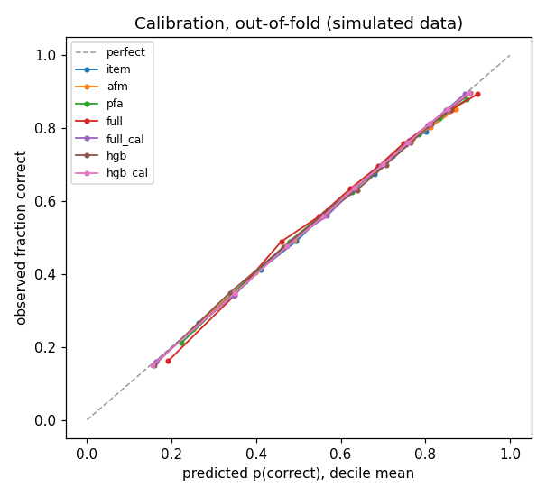
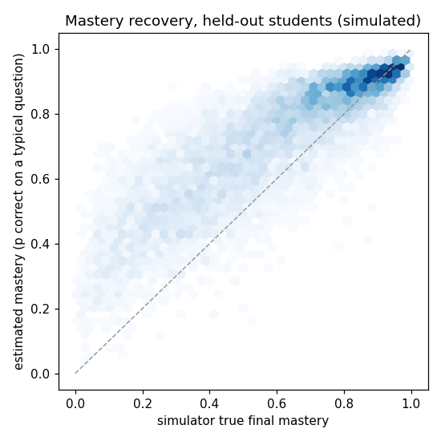
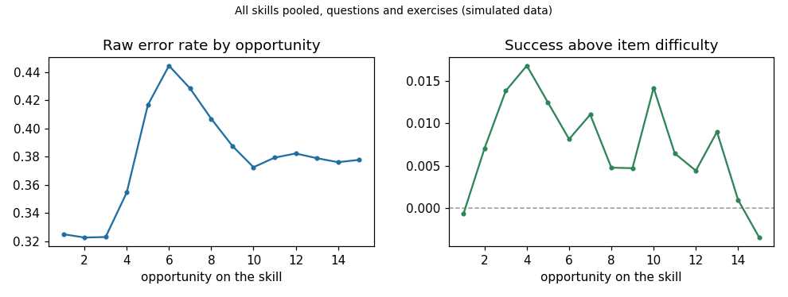
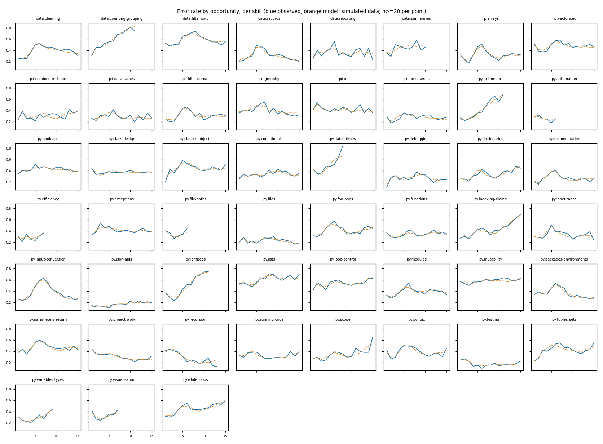

> **THESE RESULTS ARE FROM SIMULATED DATA.** Every student below was generated by
> `pypath_engine.simulate` with a known ground truth. Nothing here is evidence about real
> PyPath students, and no number in this report may be quoted as one. Replace the source with a
> real (pseudonymised) events export and re-run before claiming anything about learners.

# PyPath adaptive engine: evaluation report

Generated 2026-09-15 00:17 UTC from commit `b9fc9f0` by `python -m pypath_engine all` (engine 0.1.0, model `mastery-v1`, Python 3.9.6, numpy 2.0.2, pandas 2.2.3, sklearn 1.6.1, scipy 1.13.1, matplotlib 3.9.4).

Every number below is read from `engine/reports/metrics-*.json` produced by that command.

## Data

- Source: **simulated**, generator `logistic`, seed `20260914`, 400 students in classes of 25.
- Events written: 321,281. The simulator dropped 9,468 at the 500-event page cap and lost 2,676 whole batches; 159 students dropped out part-way.
- Ingest kept 319,629 events: 1,652 duplicates removed, 192 late flushes reordered, 87,332 Data-course units recovered from the path, 177 suspected gaps and 163 students who left mid-unit flagged.
- Attempt rows: **169,680** from 400 students: exercise 56,953, question 108,075, test 4,652. Base rate correct: 0.619.
- End-of-unit MCQ ids are tagged but never appear as rows: the site logs only the test total, so a test is one item.

## How it was split

- **Cross-validation:** GroupKFold(n_splits=5) on student id. No student is in both train and test. Confidence intervals: 95%, 200 bootstrap resamples of *students* over the pooled out-of-fold predictions.
- **Temporal holdout:** per student: first 80% of attempts train (students with <20 attempts train only); predict the next attempt and the next ten (392 students cut).
- Regularisation: C chosen per logistic model on 20% of the first fold's training students: `{'item': 1.0, 'afm': 3.0, 'pfa': 1.0, 'full': 0.3}`.

## Cross-validated results

| Model | AUC (pooled) | 95% CI | AUC fold mean ± sd | Log loss | 95% CI | Brier | ECE |
|---|---|---|---|---|---|---|---|
| Global base rate | 0.485 | [0.467, 0.507] | 0.500 ± 0.000 | 0.665 | [0.657, 0.672] | 0.236 | 0.000 |
| Item difficulty only | 0.709 | [0.705, 0.713] | 0.709 ± 0.007 | 0.597 | [0.591, 0.604] | 0.205 | 0.003 |
| Logistic, AFM (skill + opportunities + item) | 0.718 | [0.714, 0.721] | 0.718 ± 0.004 | 0.591 | [0.584, 0.598] | 0.202 | 0.006 |
| Logistic, PFA (skill + successes + failures + item) | 0.740 | [0.736, 0.744] | 0.740 ± 0.003 | 0.574 | [0.568, 0.579] | 0.195 | 0.007 |
| **Logistic, PFA + history features (ships)** | 0.766 | [0.762, 0.771] | 0.766 ± 0.002 | 0.553 | [0.547, 0.557] | 0.186 | 0.015 |
| Logistic full, isotonic-calibrated | 0.766 | [0.761, 0.771] | 0.766 ± 0.002 | 0.551 | [0.545, 0.557] | 0.185 | 0.002 |
| HistGradientBoosting | 0.770 | [0.766, 0.775] | 0.770 ± 0.003 | 0.547 | [0.541, 0.552] | 0.184 | 0.007 |
| HistGradientBoosting, isotonic-calibrated | 0.771 | [0.767, 0.775] | 0.770 ± 0.003 | 0.547 | [0.541, 0.552] | 0.183 | 0.002 |

The base rate's pooled AUC is below 0.5 only because its constant differs slightly between folds; its fold-mean AUC is 0.5.

## Lift over the two floors

| Model | Log loss vs base | 95% CI | Rel. reduction | AUC vs item | 95% CI | Log loss vs item | 95% CI |
|---|---|---|---|---|---|---|---|
| Item difficulty only | -0.0674 | [-0.0704, -0.0646] | 10.1% | +0.0000 | [0.0000, 0.0000] | +0.0000 | [0.0000, 0.0000] |
| Logistic, AFM (skill + opportunities + item) | -0.0734 | [-0.0762, -0.0707] | 11.0% | +0.0090 | [0.0065, 0.0114] | -0.0060 | [-0.0078, -0.0043] |
| Logistic, PFA (skill + successes + failures + item) | -0.0903 | [-0.0944, -0.0870] | 13.6% | +0.0314 | [0.0257, 0.0369] | -0.0229 | [-0.0272, -0.0187] |
| **Logistic, PFA + history features (ships)** | -0.1122 | [-0.1168, -0.1079] | 16.9% | +0.0573 | [0.0504, 0.0642] | -0.0448 | [-0.0503, -0.0394] |
| Logistic full, isotonic-calibrated | -0.1133 | [-0.1180, -0.1089] | 17.0% | +0.0570 | [0.0501, 0.0639] | -0.0458 | [-0.0514, -0.0404] |
| HistGradientBoosting | -0.1177 | [-0.1223, -0.1134] | 17.7% | +0.0614 | [0.0545, 0.0681] | -0.0503 | [-0.0559, -0.0448] |
| HistGradientBoosting, isotonic-calibrated | -0.1180 | [-0.1227, -0.1137] | 17.8% | +0.0618 | [0.0551, 0.0687] | -0.0505 | [-0.0563, -0.0452] |

## Temporal holdout: predicting what a student does next

**Next attempt**

| Model | n | AUC | Log loss | Brier |
|---|---|---|---|---|
| Global base rate | 392 | 0.500 | 0.638 | 0.223 |
| Item difficulty only | 392 | 0.678 | 0.568 | 0.191 |
| Logistic, AFM (skill + opportunities + item) | 392 | 0.685 | 0.566 | 0.190 |
| Logistic, PFA (skill + successes + failures + item) | 392 | 0.721 | 0.539 | 0.179 |
| **Logistic, PFA + history features (ships)** | 392 | 0.749 | 0.523 | 0.172 |
| Logistic full, isotonic-calibrated | 392 | 0.750 | 0.518 | 0.171 |
| HistGradientBoosting | 392 | 0.750 | 0.521 | 0.172 |
| HistGradientBoosting, isotonic-calibrated | 392 | 0.747 | 0.522 | 0.172 |

**Next ten attempts**

| Model | n | AUC | Log loss | Brier |
|---|---|---|---|---|
| Global base rate | 3888 | 0.500 | 0.638 | 0.223 |
| Item difficulty only | 3888 | 0.654 | 0.582 | 0.197 |
| Logistic, AFM (skill + opportunities + item) | 3888 | 0.683 | 0.572 | 0.192 |
| Logistic, PFA (skill + successes + failures + item) | 3888 | 0.720 | 0.548 | 0.183 |
| **Logistic, PFA + history features (ships)** | 3888 | 0.758 | 0.523 | 0.173 |
| Logistic full, isotonic-calibrated | 3888 | 0.758 | 0.521 | 0.172 |
| HistGradientBoosting | 3888 | 0.754 | 0.526 | 0.174 |
| HistGradientBoosting, isotonic-calibrated | 3888 | 0.755 | 0.524 | 0.174 |

## Which model ships

Gradient boosting minus the full logistic model, cross-validated AUC: **+0.0041**. The threshold, fixed in code before any run (`SHIP_THRESHOLD_AUC`), was +0.01. It was not met, so **the logistic model ships**: its coefficients can be read and explained to a teacher, and it runs in the browser as a weighted sum.

## Calibration

Expected calibration error, out-of-fold: full logistic 0.015, calibrated 0.002; gradient boosting 0.007, calibrated 0.002. Isotonic calibration does not buy enough to justify shipping a second, non-linear stage, so the shipped model is uncalibrated.

## How close to the ceiling

The simulator knows each attempt's true p(correct). Used as a predictor on the same 165,028 question and exercise rows, it scores AUC **0.778** and log loss 0.539; no model can do better on these rows. The full logistic model scores AUC 0.760 and log loss 0.555 on them, and item difficulty alone 0.704.

## Mastery recovery

estimated vs simulator-true final mastery per (student, skill), out-of-fold students only. Estimated mastery is the model's p(correct) on a typical first-attempt question on that skill.

| Estimator | Pairs | Pearson | Spearman |
|---|---|---|---|
| Model, all skills attempted | 9,055 | 0.858 | 0.865 |
| Laplace success rate, same pairs | 9,055 | 0.818 | 0.812 |
| Model, skills with 5+ attempts | 8,924 | 0.859 | 0.866 |
| Laplace, 5+ attempts | 8,924 | 0.822 | 0.817 |

**Where to call a skill mastered.** The policy declares mastery when the estimate at a skill's last practice reaches a threshold. Against simulator truth (true mastery >= 0.8) on 9,050 student-skill pairs with 3+ attempts, of which 27.1% are truly mastered:

| Threshold | Precision | Recall | F1 | Share declared mastered |
|---|---|---|---|---|
| 0.7 | 0.445 | 0.989 | 0.614 | 60.3% |
| 0.75 | 0.500 | 0.967 | 0.659 | 52.4% |
| 0.8 | 0.578 | 0.925 | 0.712 | 43.3% |
| 0.85 | 0.685 | 0.804 | 0.740 | 31.8% |
| 0.9 | 0.824 | 0.525 | 0.641 | 17.2% |

The shipped default is 0.85, chosen from this table on an earlier run of the same simulator. A false "mastered" moves a student on too early, so precision is weighted more than recall. It is tuned to the simulator and must be re-checked on real data.

## Learning curves

**Raw curves mostly do not look like learning.** Observed error at a skill's fifth opportunity is lower than at its first for only **16 of 51** skills (at least 30 attempts at both points). That is not because the simulated students do not learn -- they do, by construction -- but because opportunity number is confounded with curriculum order: every lesson puts its easier quiz questions before its harder graded exercises, so opportunities 1-3 are mostly easy items and 4-5 hard ones. The model's out-of-fold prediction (orange) follows the observed curve, so it has learned the item mix rather than misread it.

**Adjusted for item difficulty** (outcome minus the out-of-fold item-only prediction), success at the fifth opportunity is higher than at the first for **35 of 51** skills. Pooled, the adjusted curve rises for the first few opportunities and then flattens and dips: later opportunities are increasingly retries, made by the students who were struggling, which is a selection effect a raw per-opportunity average cannot remove. On real data this is the plot to read, and the raw one is the plot to distrust.

## Robustness: a simulator the model was not designed around

The main simulator generates answers from a logistic function of continuous mastery with additive learning, which is close to the PFA model's own form and flatters it. So the whole evaluation was repeated on a second simulator with a different generative story: **binary** mastery per skill that flips from unlearned to learned with a per-attempt probability, and slip/guess answers (a Bayesian Knowledge Tracing process). Same curriculum, same event damage, same splits.

| Model | AUC (pooled) | 95% CI | AUC fold mean ± sd | Log loss | 95% CI | Brier | ECE |
|---|---|---|---|---|---|---|---|
| Global base rate | 0.490 | [0.474, 0.506] | 0.500 ± 0.000 | 0.606 | [0.597, 0.615] | 0.208 | 0.000 |
| Item difficulty only | 0.749 | [0.742, 0.756] | 0.749 ± 0.007 | 0.521 | [0.511, 0.532] | 0.175 | 0.003 |
| Logistic, AFM (skill + opportunities + item) | 0.803 | [0.797, 0.809] | 0.803 ± 0.008 | 0.480 | [0.470, 0.490] | 0.159 | 0.015 |
| Logistic, PFA (skill + successes + failures + item) | 0.863 | [0.860, 0.865] | 0.863 ± 0.003 | 0.415 | [0.408, 0.422] | 0.134 | 0.023 |
| **Logistic, PFA + history features (ships)** | 0.880 | [0.878, 0.882] | 0.880 ± 0.003 | 0.390 | [0.385, 0.396] | 0.124 | 0.027 |
| Logistic full, isotonic-calibrated | 0.880 | [0.878, 0.882] | 0.880 ± 0.003 | 0.385 | [0.379, 0.392] | 0.123 | 0.003 |
| HistGradientBoosting | 0.897 | [0.895, 0.899] | 0.897 ± 0.003 | 0.360 | [0.353, 0.365] | 0.114 | 0.009 |
| HistGradientBoosting, isotonic-calibrated | 0.897 | [0.895, 0.900] | 0.897 ± 0.003 | 0.359 | [0.353, 0.365] | 0.114 | 0.004 |

Oracle AUC under this simulator: 0.943; full logistic 0.878.

Mastery recovery under this simulator: model Pearson 0.722, Laplace 0.597 (9,383 pairs).

Gradient boosting minus full logistic AUC here: **+0.0168**, which **exceeds** the 0.01 threshold. Under a process with discrete mastery the linear logistic model underfits: gradient boosting beats it clearly, and the logistic model sits further below the oracle than it does on the main simulator. The shipping decision is still made on the main run, and still goes to the logistic model for explainability and a browser that can only evaluate a weighted sum, but this is the strongest evidence in this report that the model family is a choice with a cost. If real learning turns out to be step-like, a knowledge-tracing model (or boosting) is worth the loss of simplicity.

## The shipped model's history coefficients

Mean over the five training folds, and whether the sign held in all five. A coefficient whose sign flips between folds should not be explained to anyone as meaning something.

| Feature | Mean coefficient | Same sign in every fold |
|---|---|---|
| `attempt_log` | +0.489 | yes |
| `is_retry` | -0.181 | yes |
| `decay_succ` | +0.008 | yes |
| `decay_fail` | +0.010 | yes |
| `days_since_log` | +0.055 | yes |
| `no_history` | +0.084 | yes |
| `partial_rate` | +0.374 | yes |
| `has_partial` | -0.101 | yes |
| `err_syntax` | -0.512 | yes |
| `err_name` | -0.482 | yes |
| `err_type` | -0.351 | yes |
| `err_other` | +0.000 | no |
| `exposure_log` | +0.691 | yes |
| `prereq_min` | +1.721 | yes |
| `dur_rushed` | -0.617 | yes |
| `dur_long` | -0.307 | yes |
| `dur_outlier` | -0.327 | yes |
| `kind_exercise` | -1.093 | yes |
| `kind_test` | -1.718 | yes |
| `kind_quiz` | +0.000 | no |

Coefficients of exactly zero (`err_other`, `kind_quiz`) are features the simulator never produces (no teacher-assigned quizzes, and every simulated error class falls into a named group). They carry no weight because they carry no data, and will stay at zero until real data exercises them.

The largest history weight is `prereq_min` (+1.72). In the simulator, prerequisites slow learning by construction, so a heavy prerequisite weight partly measures the simulator's own assumption.

## Where this is weakest

- **The simulator does much of the work.** The data were generated by a process built from the same ideas the features encode: mastery that rises with attempts, prerequisites that slow learning, errors that depend on mastery. Good numbers here show the pipeline is correct and can recover a signal *when that signal exists in this form*. They do not show real students behave this way. The BKT robustness run narrows that gap a little; it does not close it.
- **On the main simulator, mastery recovery is only modestly better than counting.** A Laplace-smoothed success rate reaches Pearson 0.818 against the model's 0.858. Most of what the model knows about a skill is how often the student got it right. Under the BKT simulator the gap is wider (model 0.722, Laplace 0.597), but recovery itself is lower.
- **The linear model underfits step-like learning.** See the robustness section: under BKT, gradient boosting beats it by more than the shipping threshold, and the logistic model sits well below the oracle.
- **The next-attempt holdout is small**: 392 predictions, one per student, so its AUC moves by a few hundredths with the seed. The next-ten version and the cross-validation are the numbers to lean on.
- **The mastery threshold (0.85) was tuned on the simulator** and has no real-data backing.
- **No real data has been through it.** Production event volume is thin, and the log cannot say which unit test questions a student missed, which course a test belonged to, or the order of events within a flush.
- **The tags are partly automatic.** 687 end-of-unit items were tagged by keyword, spot-checked at 20 of 24; see `assets/data/skills.json` `itemSource`. Those items only reach the model as whole-unit tests, which limits the damage.
- **The events are self-reported** by the student's own browser and can be fabricated. See `MODEL_CARD.md`.
